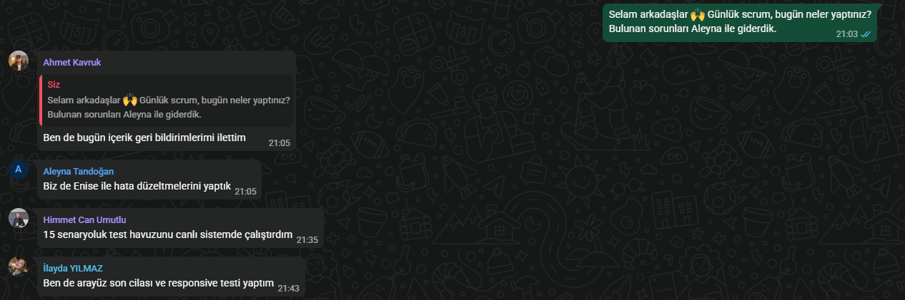
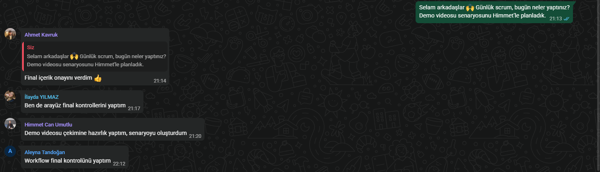
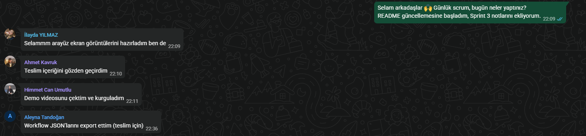
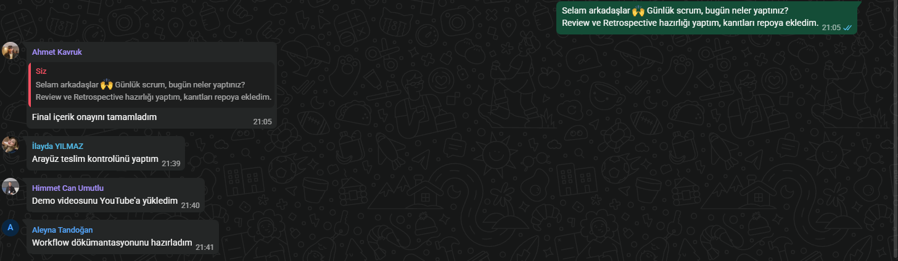

# Sprint 3 — Daily Scrum

Günlük scrum toplantıları WhatsApp üzerinden yazılı yapılmıştır. Ekran görüntüleri gün gün aşağıdadır.

## 21 Temmuz 2026 — Salı

## 22 Temmuz 2026 — Çarşamba

## 23 Temmuz 2026 — Perşembe

## 24 Temmuz 2026 — Cuma

## 25 Temmuz 2026 — Cumartesi

## 26 Temmuz 2026 — Pazar

## 27 Temmuz 2026 — Pazartesi

## 28 Temmuz 2026 — Salı

## 29 Temmuz 2026 — Çarşamba

## 30 Temmuz 2026 — Perşembe

## 31 Temmuz 2026 — Cuma

## 1 Ağustos 2026 — Cumartesi

## 2 Ağustos 2026 — Pazar
Sprint 3 bugün itibarıyla tamamlandı. Ürün uçtan uca canlı çalışır durumda: arayüz canlıya alındı (hakpusulasi.lovable.app), n8n Cloud üzerindeki workflow Gemini ve Supabase ile entegre, self-check ve hukuki uyarı aktif. Tanıtım videosu hazırlanıp YouTube'a yüklendi. Son olarak README, board ve teslim dosyaları gözden geçirildi ve final teslim gerçekleştirildi.
